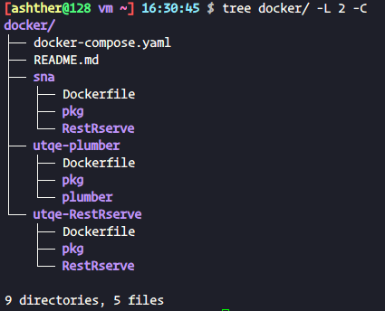
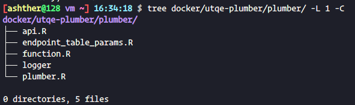
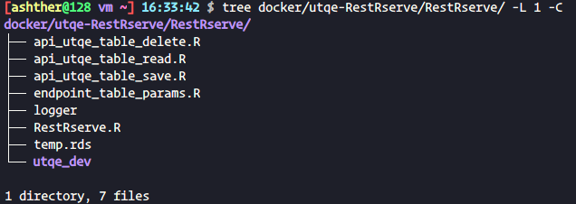

#### 离线安装R包的准备工作
```R
getPackages <- function(packs){
  packages <- unlist(
    tools::package_dependencies(packs, available.packages(),
                                which = c("Depends", "Imports"), recursive = TRUE)
  )
  packages <- union(packs, packages)
  packages[!packages %in% unname(installed.packages()[
    !is.na(installed.packages()[, 'Priority']), 
    'Package'
    ])]
}

pkg_to_install_cran <- c('dplyr', 'igraph', 'luzlogr', 'jsonlite', 'Rserve', 'R6', 
                         'yaml', 'swagger', 'mime', 'curl', 'testthat', 'devtools')
pkg_to_install_gh <- c('dselivanov/RestRserve')

pkg_to_download_cran <- getPackages(pkg_to_install_cran)
download.packages(pkg_to_download_cran, '~/docker/PROJECT_PATH/pkg')

purrr::walk(
  pkg_to_install_gh, 
  ~ system(
    sprintf('git clone https://github.com/%s %s', 
            .x, 
            file.path('~/docker/PROJECT_PATH/pkg', unlist(strsplit(pkg_to_install_gh, '/'))[2]))
  )
)

tools::write_PACKAGES('~/docker/PROJECT_PATH/pkg/', verbose = TRUE)
```

#### 目录结构
多项目的目录结构如下<br/>
<div align=center></div>

#### 以项目utqe-plumber为例：<br/>
<div align=center></div>

+ **`Dockerfile`**：构建该项目环境的镜像制作文件
+ **`pkg`**：制作镜像时所需离线安装包的源码和索引等文件
+ **`plumber`**：容器启动后需要挂载的目录，包括了功能函数的`function.R`和定义全局变量、数据库连接、端点、过滤器函数的`api.R`文件以及用于启动的`plumber.R`文件，其他数据文件也放置于此，便于容器启动时挂载

需要注意的是，由于`plumber::plumb`内部在运行功能和路由函数脚本时，创建了独立的环境，也就是`source(file, local=private$envir, echo=FALSE, keep.source=TRUE)`，所以所有的全局变量应在`api.R`中定义，`api.R`中`source`其他脚本时应加入`local = TRUE`参数。

#### 以项目utqe-RestRserve为例：<br/>
<div align=center></div>

+ **`Dockerfile`**：构建该项目环境的镜像制作文件
+ **`pkg`**：制作镜像时所需离线安装包的源码和索引等文件
+ **`RestRserve`**：容器启动后需要挂载的目录，包括了功能和路由函数的`api_*.R`文件以及定义端点、数据库连接、全局变量等的`RestRserve.R`文件，其他数据文件也放置于此，便于容器启动时挂载

由于需要RestRserve以前台模式启动并保持，所以不使用先`restrserve_deploy`再`restrserve_start`的启动方式，而是在原定义接口函数的脚本末添加：
```R
RestRserveApp$run(http_port = "8000", 
                  encoding = 'utf8', 
                  port = '6311', 
                  remote = 'enable')
```

#### docker容器启动
```bash
$ sudo docker run --rm -e TZ=Asia/Shanghai -p 8000:8000 -v $HOME/docker/PROJECT_PATH/RestRserve:/home/rstudio/ -d PROJECT_IMAGE 
```

注意修改`api.R`或`RestRserve.R`脚本起始的`HOME_PATH`为`/home/rstudio`

#### docker compose
`docker-compose.yaml`配置文件中对于多个服务进行了定义
```bash
$ docker-compose -f ./docker-compose.yaml up -d --scale SERVICE=2 # 启动两个SERVICE
$ docker-compose -f ./docker-compose.yaml ps # 查看当前启动的服务
$ docker-compose -f ./docker-compose.yaml down # 关闭所有服务
```
