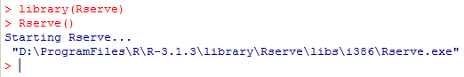
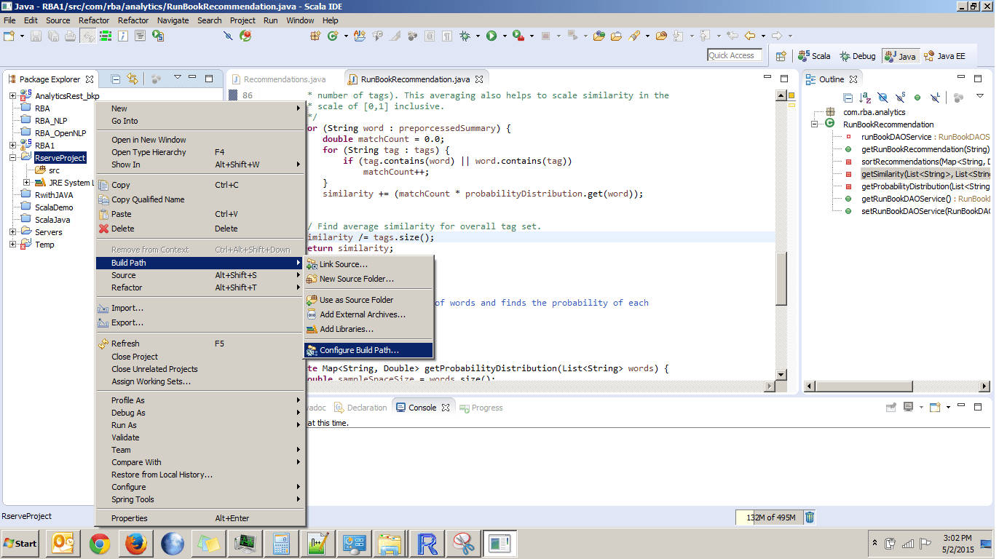
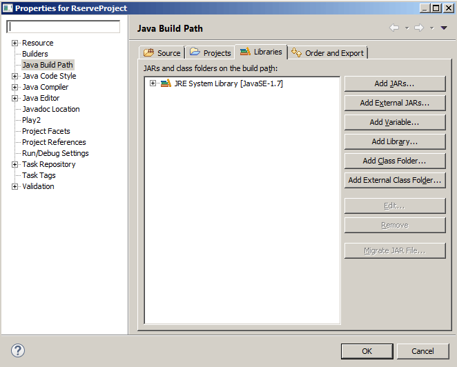
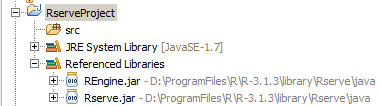

工具版本：
32位win7，1.7或者更高版本的JDK，Eclipse（Luna），R 3.1.3

### 步骤1 安装Rserve包
```bash
R CMD INSTALL Rserve_1.7-3.tar.gz # 安装包提前下好，为了避免麻烦，最好从命令行安装
```

### 步骤2 启动Rserve服务器
为了启动Rserve服务器，首先要导入Rserve包
```r
library(Rserve)
Rserve()
```
或者（最好）从命令行启动，并允许远程连接
```bash
R CMD Rserve --RS-enable-remote
# iptables -I INPUT -p tcp --dport 6311 -j ACCEPT # 可能需要手动开启6311端口
```
或者以`R CMD Rserve --RS-conf Rserv.conf`的方式启动，这时需要编辑好配置文件Rserv.conf
```
remote enable
encoding utf8
source /home/slj/Rserv_conf/Rserv_conf.R
```
其中的`Rserv_conf.R`为加载library和数据文件的R脚本

命令行启动Rserve遇到`Rserve: not found`错误时，创建软连接
```bash
# which R
# /usr/local/bin/R
cd /usr/local/lib64/R/bin
ln -s /usr/lib64/R/library/Rserve/libs/Rserve Rserve
```

你的控制台将会看到：  



### 步骤3 创建java客户端
现在Rserve服务器已经在运行了， 你需要一段java程序来利用Rserve调用R，我们在Eclipse中创建如下程序：
* 开启Eclipse Luna
* 创建一个叫**RserveProject**的java项目
* Rserve提供了一些用在java程序中的客户端jars，这些jar文件已经包含在了安装好的Rserve包里
* 我的这些jar文件在**D:\ProgramFiles\R\R-3.1.3\library\Rserve\java\**，你的在**<YOUR_R_HOME>\library\Rserve\java\\**，主要需要的jar文件是**REngine.jar**和**Rserve.jar**
* 你需要把这两个jars包含在你的Eclipse项目里，在**Package Explorer**里右键点击项目并选择**Build Path > Configure Build Path**  


* 在**Properties for RserveProject**窗口中选择**Libraries**选项卡  


* 选择**Add External JARs**按钮，浏览**<YOUR_R_HOME>\library\Rserve\java\**，选择**REngine.jar**和**Rserve.jar**文件，打开并确定
* 现在你的Eclipse项目的结构将看起来像  


* 现在在RserveProject的**src**文件夹下创建一个叫**pkg**的包，在**pkg**下面创建一个类**Temp.java**

### 步骤4 创建R脚本
```r
myAdd=function(x,y){
    sum=x+y
    return(sum)
}
```
我们定义了myAdd函数，保存为MyScript.R

### 步骤5 在java程序中调用R脚本
创建如下程序
```java
package pkg;

import org.rosuda.REngine.REXPMismatchException;
import org.rosuda.REngine.Rserve.RConnection;
import org.rosuda.REngine.Rserve.RserveException;

public class Temp {

    public static void main(String a[]) {
        RConnection connection = null;

        try {
            /* Create a connection to Rserve instance running on default port
             * 6311
             */
            connection = new RConnection();

            /* Note four slashes (\\\\) in the path */
            connection.eval("source('D:\\\\MyScript.R')");
            int num1=10;
            int num2=20;
            int sum=connection.eval("myAdd("+num1+","+num2+")").asInteger();
            System.out.println("The sum is=" + sum);
        } catch (RserveException e) {
            e.printStackTrace();
        } catch (REXPMismatchException e) {
            e.printStackTrace();
        }
    }
}
```


在java程序中加入
```java
RConnection connection = new RConnection();
```
Rserve就能够同时处理多请求（Linux可以直接这样做），在Windows平台你需要手动开启3个Rserve实例来获得3个R线程
```r
Rserve(port=6311)
Rserve(port=6312)
Rserve(port=6313)
```
而在java端，需要
```java
 //Connect Thread 1 to instance running on port 6311
 RConnection connection = new RConnection("hostIP_or_hostName",6311);
 
 //Connect Thread 2 to instance running on port 6312
 RConnection connection = new RConnection("hostIP_or_hostName",6312);
 
 //Connect Thread 3 to instance running on port 6313
 RConnection connection = new RConnection("hostIP_or_hostName",6313);
 
```
