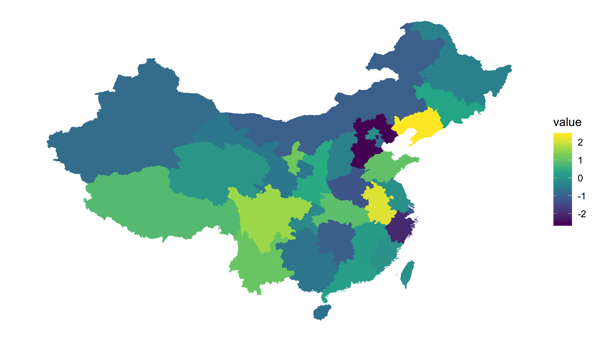

# 多图布局
```r
library(tidyverse)
library(ggthemes)
library(ggthemr)
library(wesanderson)
library(gridExtra)

set.seed(1234)
x <- c(rnorm(500, mean = -1), rnorm(500, mean = 1.5))
y <- c(rnorm(500, mean = 1), rnorm(500, mean = 1.7))
group <- as.factor(rep(c(1,2), each = 500))
df <- data.frame(x, y, group)

ggthemr('light')
on.exit(ggthemr_reset())

xdensity <- ggplot(df, aes(x)) + 
  geom_density(aes(color = group, fill = group), size = 1.2, alpha = 0.3) + 
  scale_color_manual(values = wes_palette('Moonrise2', 2)) + 
  scale_fill_manual(values = wes_palette('Moonrise2', 2))

ydensity <- ggplot(df, aes(y)) + 
  geom_density(aes(color = group, fill = group), size = 1.2, alpha = 0.3) + 
  scale_color_manual(values = wes_palette('Moonrise2', 2)) + 
  scale_fill_manual(values = wes_palette('Moonrise2', 2))

xyscatter <- ggplot(df, aes(x, y, color = group)) + 
  geom_point() + 
  theme(legend.position = c(0, 1), 
        legend.justification = c(0, 1)) + 
  scale_color_manual(values = wes_palette('Moonrise2', 2))

blankplot <- ggplot() + 
  geom_blank(aes(1, 1)) + 
  theme(axis.title.x = element_blank(), 
        axis.title.y = element_blank(), 
        axis.text.x = element_blank(), 
        axis.text.y = element_blank(), 
        plot.background = element_blank(), 
        panel.grid.major = element_blank(), 
        panel.grid.minor = element_blank(), 
        panel.background = element_blank(), 
        panel.border = element_blank(), 
        axis.ticks = element_blank())

grid.arrange(xdensity, blankplot, xyscatter, ydensity, 
             nrow = 2, widths = c(4, 2), heights = c(2, 4))
```


# 如何绘制地图
```r
# download from http://www.diva-gis.org/gdata
# 由于众所周知的原因，China和Taiwan的数据文件都需要下载
shape_china_mainland_adm <- readShapeSpatial('CHN_adm1.shp')
shape_taiwan_adm <- readShapeSpatial('TWN_adm1.shp')

province <- tibble(NAME_1 = c(as.character(shape_china_mainland_adm@data$NAME_1), 
                              'Taiwan'), 
                   value = rnorm(32))

shape_china_mainland <- shape_china_mainland_adm %>% 
  fortify() %>% 
  left_join(select(shape_china_mainland_adm@data, ID_1, NAME_1) %>% 
              mutate(ID_1 = as.character(ID_1 - 1)), 
            by = c('id' = 'ID_1'))

shape_taiwan <- shape_taiwan_adm %>% 
  fortify() %>% 
  mutate(NAME_1 = 'Taiwan')

shape_china <- bind_rows(shape_china_mainland, shape_taiwan) %>% 
  mutate(NAME_1 = as.character(NAME_1)) %>% 
  left_join(province, by = 'NAME_1')

shape_china %>% 
  ggplot(aes(x = long, y = lat, group = group)) + 
  geom_polygon(aes(fill = value)) + 
  scale_fill_viridis_c() + 
  theme(panel.background = element_blank(), 
        axis.ticks = element_blank(), 
        axis.text = element_blank()) + 
  xlab('') + 
  ylab('')
```

