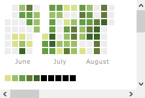

<<<<<<< HEAD
---
title: "Is 2016 the HOTTEST year in past 20 years in Xi'an?"
output:
  html_notebook: default
  html_document: default
---

```{r}
library(dplyr)
library(tidyr)
library(magrittr)
library(weatherData)
library(ggplot2)
library(rChartsCalendar)

weather_xian <- seq(1996, 2016, 1) %>% 
  lapply(getWeatherForYear, station_id = 'XIY') %>% 
  do.call(rbind, .) %T>% {
    .$Date <- as.POSIXct(.$Date)
  } %>% 
  mutate(week = format(Date, '%Y-%W')) %>% 
  separate(Date, c('year', 'month', 'day'))

groupTop <- function(weather_xian, varGrup, varMn, k) {
  varGrup <- lapply(varGrup, as.symbol)
  weather_xian %>% 
    group_by_(.dots = varGrup) %>% 
    summarise_(value = sprintf("mean(%s, na.rm = TRUE)", varMn)) %>% 
    top_n(k) %>% 
    arrange(desc(value))
}

```

来看一下过去20年月平均温度（分别用日平均温度值和日最高温度值进行汇总），2016年8月确实要突破天际了
```{r}
groupTop(weather_xian, c('year', 'month'), 'Mean_TemperatureC', 10)
groupTop(weather_xian, c('year', 'month'), 'Max_TemperatureC', 10)
```

再看一下周平均温度，第33周也就是8月15日这周，不是历史顶峰也是数一数二的热
```{r}
groupTop(weather_xian, 'week', 'Mean_TemperatureC', 10)
groupTop(weather_xian, 'week', 'Max_TemperatureC', 10)
```

从各月历史趋势来看，2016年8月是个特例
```{r}
weather_xian %>% 
  group_by(year, month) %>% 
  summarise(avg = mean(Mean_TemperatureC, na.rm = TRUE)) %>% 
  ungroup() %T>% {
    .$year <- as.integer(.$year)
    .$month <- as.integer(.$month)
  } %>% 
  ggplot(aes(year, avg)) + 
  geom_point() + 
  geom_smooth(se = FALSE) + 
  facet_wrap( ~ month) + 
  theme(axis.text.x = element_text(angle = 90, hjust = 1))
```

更直观地看一下，这是过去20年6至8月的日平均温度，超过27度的只有几天，而且温度不高
```{r}
weather_xian %>% 
  group_by(month, day) %>% 
  summarise(avg = mean(Mean_TemperatureC, na.rm = TRUE)) %>% 
  ungroup() %>% 
  unite(date, month, day, sep = '-') %>% 
  transform(date = as.character(as.Date(date, '%m-%d'))) %>% 
  filter(avg >= 27) %>% 
  plotCalMap(
    x = 'date', 
    y = 'avg', 
    data = ., 
    domain = 'month', 
    start = '2016-06-01', 
    legend = seq(27, 35, 1), 
    itemName = 'temperatureC', 
    range = 3
  )
```


2016年超过27度的已经不是一周两周了，这么一看，2016年的热不仅是峰值很高，也是颇为持久
```{r, echo=TRUE}
weather_xian %>% 
  filter(year == '2016') %>% 
  unite(date, month, day, sep = '-') %>% 
  transform(date = as.character(as.Date(date, '%m-%d'))) %>% 
  filter(Mean_TemperatureC >= 27) %>% 
  plotCalMap(
    x = 'date', 
    y = 'Mean_TemperatureC', 
    data = ., 
    domain = 'month', 
    start = '2016-06-01', 
    legend = seq(27, 35, 1), 
    itemName = 'temperatureC', 
    range = 3
  )
```


